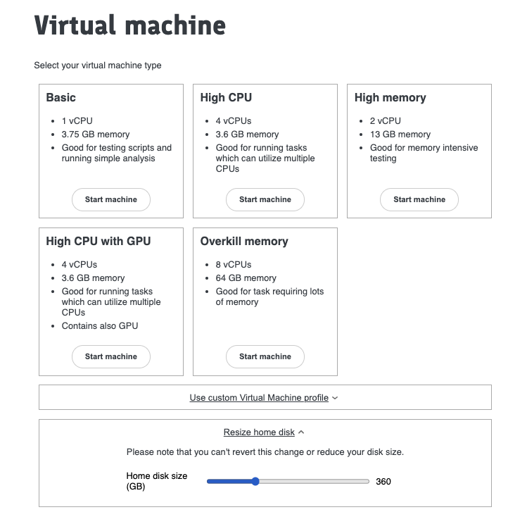

#

## Disk Size

By default, your /home directory's disk size is 100G. If you need to increase the disk size of your /home directory for any reason, you can do so from the **Virtual Machines** page.

1- Shutdown your VM if it is running.

2- While creating a new VM from the **Virtual Machines** page, click on the **Resize home disk** section to expand it.

3- Use the slider to adjust the disk size according to your needs.

4- Start the new VM with your preffered machine type.

The /home disk will be extended to the new size and previous data will be retained.

:::note

    Please note that it is recommended to store long-term data in the red bucket and we advise to not treat the /home directory as
    your permanent storage location. Disk size can be increased upto 1000G.
:::
