# 

## The G&H ‘red’ bucket

In this guide we explain what G&H buckets are and the 3 methods for managing data on the G&H TRE’s ‘red’ bucket.
The three ways to manipulate folders and files in the red bucket are:
 1) using the “Upload to red bucket” option in the File Manager.
 2) using the gcloud command line interface.
 3) mounting your red folder into your virtual machine.

### Understanding G&H buckets

#### G&H and Google Cloud Storage (GCS) buckets

Genes & Health TRE data are stored in Google Cloud Storage (GCS) buckets (on a server located in London, UK).  Buckets are the basic data container for GCS and everything stored in GCS must be contained in a bucket.  Each of the usual G&H TRE top level storage domains are separate GCS buckets, for example, ‘library-red’, ‘red’, ‘green’ and ‘exomes-library-red’.  The ‘red’ bucket is for TRE users to store scripts and data safely (with versioning back-up) and to permit the sharing these between project collaborators.

Files in a G&H TRE bucket are just that. The bucket contains a collection of files.

#### GCS buckets and directories

The concept of a physical directory does not rightly exist in GCS.  Rather, directories are “simulated” by GCS from the files name.  This can be illustrated as follows:

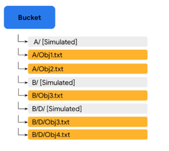

In the image above, the filenames are “A/Obj1.txt”, “A/Obj2.txt”, “B/Obj3.txt”, “B/D/Obj3.txt” and “B/D/Obj4.txt” and the files simply exists a files in the bucket with those filenames.  Bucket folders ‘A/’ and ‘B/’ and the sub-folder ‘D/’ are simulated. This means that is you were to delete “A/Obj1.txt” and “A/Obj2.txt”, the simulated folder “A/” would disappear (there would no longer be filenames justifying its existence).  However, if you were to delete file “B/Obj3.txt”, both simulated folder ‘B/’ and sub-folder ‘D/’ would remains as they would be accounted for by filenames “B/D/Obj3.txt” and “B/D/Obj4.txt”.  In the rest of this guide, when we refer to (GCS) directories, we refer to such simulated directories.

#### G&H GCS buckets and URLs

On the TRE, /red/ “lives” on the file system (/genesandhealth/red/) as shown below:

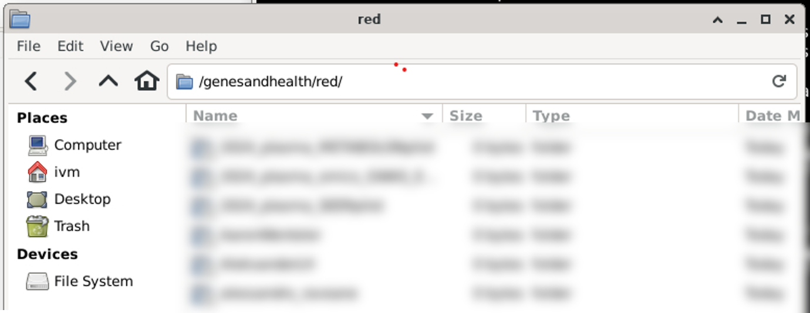

Physically though, as the /red/ bucket is stored on a Google Cloud file server, it has a Uniform Resource Locator (URL).  The URL will depend on the sandbox you use.

For sandbox-1, the URL is gs://qmul-production-sandbox-1-red/ and, predictably, you need to change the number in the URL to match your sandbox number.  When moving things to and from the red bucket using either gcloud (Option 2) or file mounting (Option 3), you will need to use the URL.

### Option 1 – “Upload to red bucket” option in the File Manager

#### Uploading a file to ‘red’

To upload a file to ‘red’ from another location (here my home folder on ivm), right click on the file and select “Upload to red bucket”.

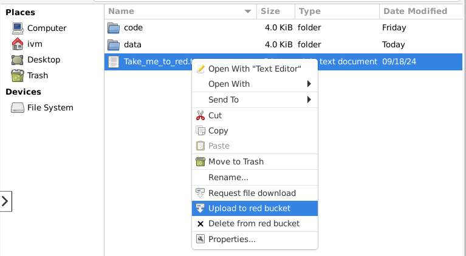

A new window should pop-up documenting the outcome, for example:

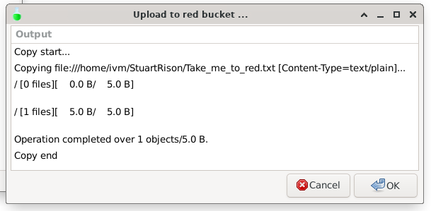

However, this will upload to file to the top directory in ‘red’.  This is not recommended.  Rather you should upload your files into your personal or project ‘red’ directory.

#### Creating/uploading to a directory in red

##### Creating a new directory in ‘red’

If you want to create a new directory in ‘red’, you must upload one into it.  Remember that a GCS simulated directory can only exists if it is accounted for by a file.  If you try to upload an empty directory from a different location to ‘red’, you will get the following error:

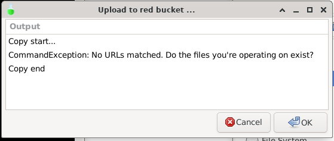

Your directory must contain at least one file to be uploaded to the ‘red’ bucket.

To create a new directory in ‘red’, first create an identically named directory in /home/ivm/ using one of the two methods below:

###### Creating a new directory and file in File Manager

To create a directory and file to upload to ‘red’ in File Manager, right-click in empty space and select “Create New Folder”, then enter your folder name and click ‘OK’.

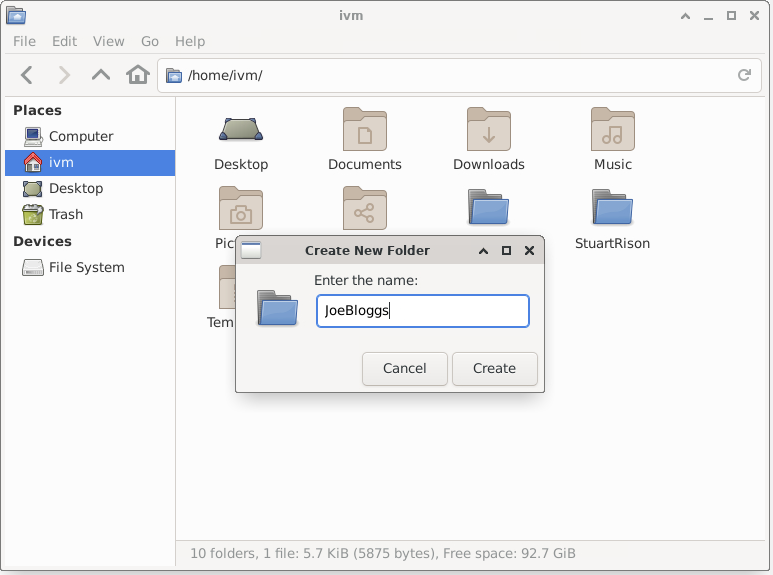

Now enter the new folder, right-click in empty space and select “Create Document / Empty File”

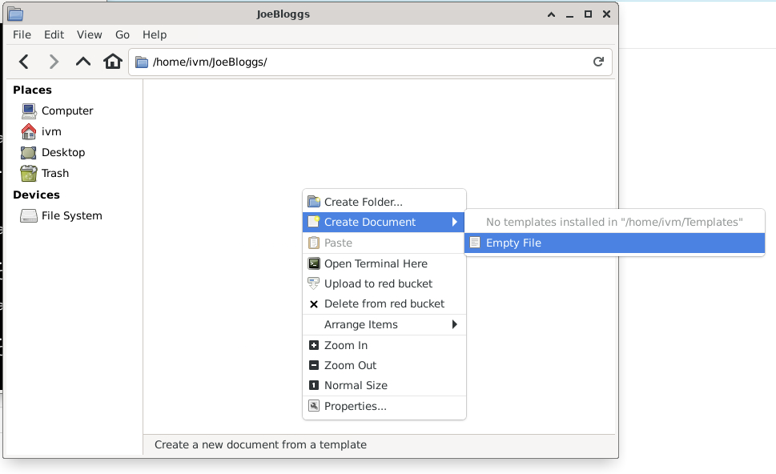

Give the file whatever name you want and click “Create”

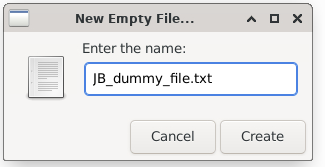

You now have a folder called “JoeBloggs” which contains an (empty) file called “JB_dummy_file.txt”.

##### Creating a new directory and file in Terminal

To create a new directory using the Terminal, first create a directory using the ‘mkdir’ command, enter the directory with the ‘cd’ command and create an empty file in this directory with the ‘touch’ command as illustrated below.

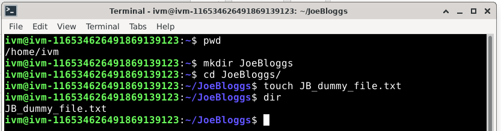

Using either of the methods above, you should end up with the following directory on /home/ivm/:

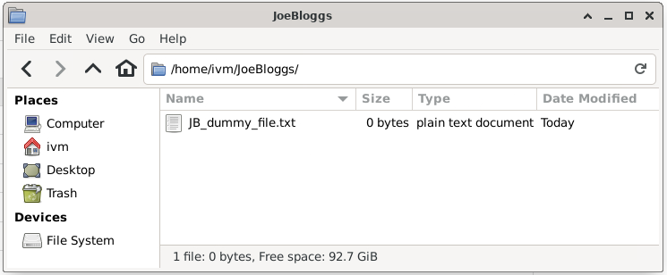

Now navigate back to the JoeBloggs directory, right-click on the directory icon and select “Upload to red bucket”.

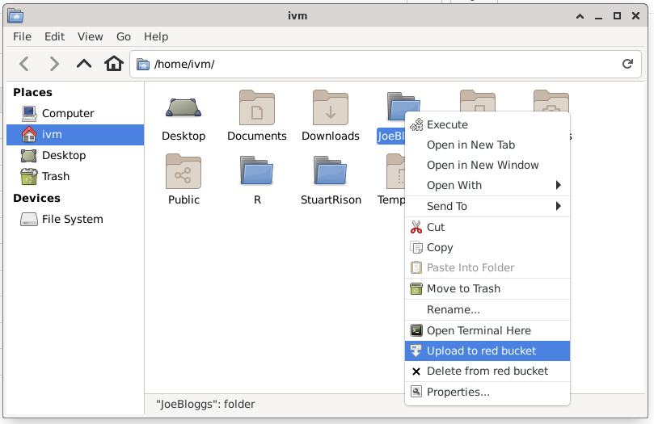

The ‘red’ bucket now contains a (virtual) directory called ‘JoeBloggs’ with the (empty) file ‘JB_dummy_file.txt’:

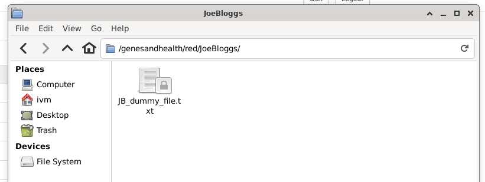

**Be careful, if you delete all files in a ‘red’ bucket directory, you will also delete the virtual directory.**  In this case, if you right click JB_dummy_file.txt, the JoeBloggs directory will disappear.

#### Creating a sub-directory in the ‘red’ bucket

To create a sub-directory in the ‘red’ bucket, you need to create an identical directory tree in /home/ivm/ (or another drive allowing this) and upload this to ‘red’.

For example, suppose we wanted to create a JoeBloggs sub-directory called ‘JB_data_dir’ we would do the following:

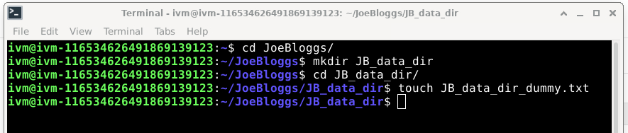

And then navigate to the JoeBloggs directory in /home/ivm/ and right-click “Upload to red bucket”:

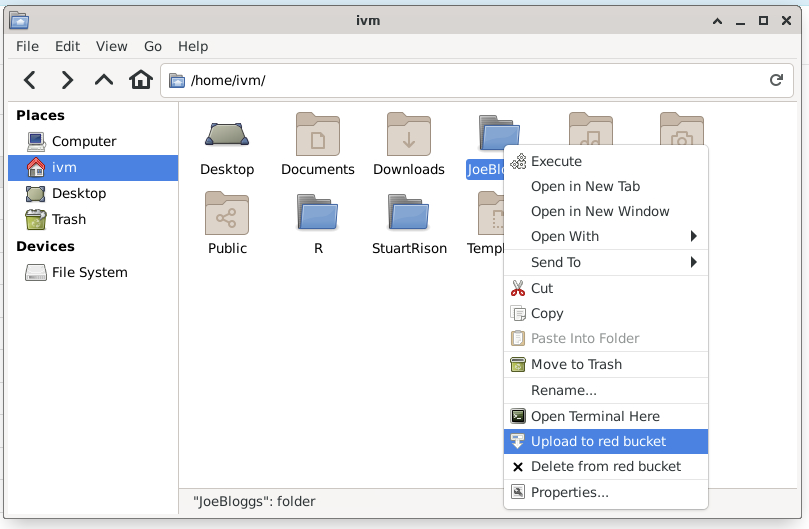

You now have the (virtual) directory structure /red/JoeBloggs/JB_data_dir/ in ‘red’ with the file ‘JB_data_dir_dummy.txt’ in the directory.

**BE CAREFUL**

 *	this will upload **any new** file or directory in the /home/ivm/JoeBloggs/ directory, for example, if you added “v_large_temp_file_that_should_definitely_not_be_moved.gz” in the /home/ivm/JoeBloggs/  directory, this will be uploaded to ‘red’
 * the “Upload to red bucket” option will not replicate your /home/ivm/JoeBloggs/ directory to ‘red’, it will only upload new files or directories (as long as they contain at least one file) to the ‘red’ bucket. I.e. if you delete /home/ivm /JoeBloggs/JB_data_dir/ and then select “Upload to red bucket” for /home/ivm /JoeBloggs/, there will still be a /red/ JoeBloggs/JB_data_dir/ directory.

#### Moving or renaming data in the ‘red’ bucket

This is not possible.  It is probably easier to delete the data you want to move or rename within red and re-upload the data in a new location/with a new name as per the methods above.

**BE CAREFUL**

 * **It is recommended you make sure you have a suitable copy of the data you are trying to move/rename before doing so!**
 * If you are moving large files, you may incur significant data charges

### Option 2 – Using Google Cloud Services’ gcloud commands

#### What is gcloud?

gcloud is the Google Cloud Command Line Interface (CLI): a set of tools to create and manage Google Cloud resources.  gcloud has multiple GROUPS which handle a specific aspect of the Google Cloud.  For example, ‘gcloud sql’ handles the creation and management of Google Cloud SQL databases and ‘gcloud source’ handles cloud git repository commands.

**The only gcloud GROUP of relevance to the G&H TRE is the ‘storage’ group.** ‘gcloud storage’ handles the creation and management of Cloud Storage buckets and objects (files).

‘gcloud storage’ documentation can be found at https://cloud.google.com/sdk/gcloud/reference/storage

#### What if I’m using gutils?

Some of you may have been using gutils to manage Cloud Storage buckets and objects.  The gutils commands are now deprecated.  

**BE CAREFUL**

 * Google states: "**Important**: gsutil is not the recommended CLI for Cloud Storage. Use gcloud storage commands in the Google Cloud CLI instead."
 * **We advise you against using of gutils.**  The gsutil tool does not support working with newer Google Cloud Storage’s features such as soft delete.  This means that gsutil removes all versions of a file, whereas ‘gcloud storage’ only removes the latest version.
 * We have bucket versioning switched on in sandboxes as part of the backup strategy (so we can recover an old version of a file for users). **If you delete with gutils, we may not be able to recover the file(s).**

 #### GCS bucket URLs

 As stated in the “Understanding G&H buckets” section, to use gcloud commands, you need the URL of your sandbox’s red bucket.

 For sandbox-1, the URL is **gs://qmul-production-sandbox-1-red/** and, predictably, you need to change the number in the URL to match your sandbox number.

#### Creating a new directory in /red/

If you want to create a new directory in ‘red’, you must upload one into it. Remember that the concept of a directory does not rightly exist in Google cloud buckets.  Google bucket store files.  This means that you cannot just upload an empty directory into the ‘red’ bucket.  If you try to do so, you will get the following error:

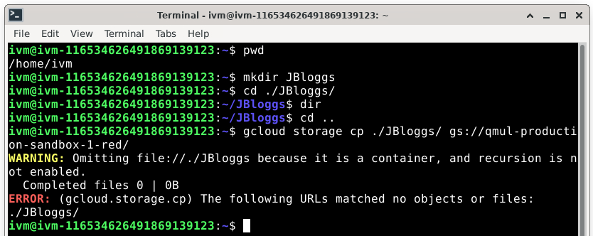

To successfully create a new directory or directory branch in /red/ with ‘gcloud storage’ you simply need to copy (or move) a file to the /red/ bucket.  The simplest is often to create an empty file using the linux touch command.

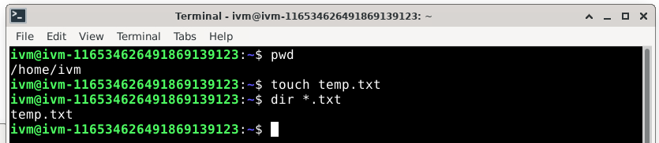

Now copy this empty file using:

```
gcloud storage cp [dummy_file] [destination/on/red/bucket/]
```

So for example:

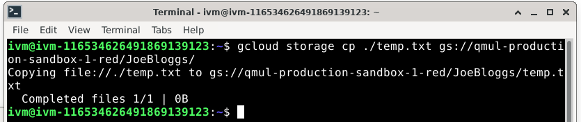

**Do not forget to end the destination location with a / (forward-slash).  If you do not, you will copy temp.txt into a file called JoeBloggs on the /red/ folder.**

You could also simply move the file using:

```
gcloud storage mv [dummy_file] [destination/on/red/bucket/]
```

You can create further subdirectories by specifying them in the destination location.  For example, if you wanted to create /red/JoeBloggs/Data/GWAS_data/Jan2024, you would do the following:

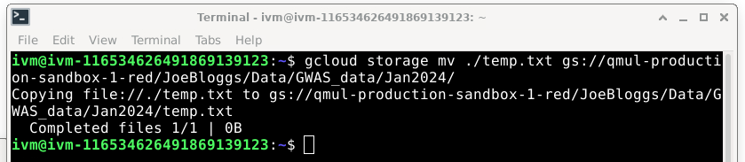

You now have created all the (virtual) sub-directories along the way:

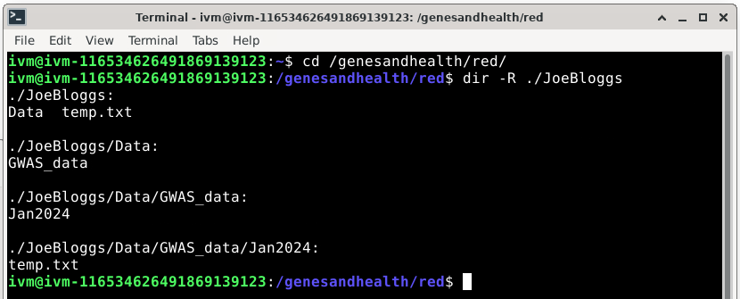

Please note that this will only upload new files or directories (as long as they contain at least one file or non-empty subdirectory) to the /red/ bucket. Pre-existing files in /red/ will not be affected.  For example, you can see that the “temp.txt” file we created in /red/JoeBloggs/ when we used the `gcloud storage cp ./temp.txt gs://qmul-production-sandbox-1-red/JoeBloggs/` command is still there.

**Remember if you delete all files in a /red/ bucket directory, you will also delete the virtual directory they are in.  **

In the example above, if you delete /red/JoeBloggs/Data/GWAS_data/Jan2024/temp.txt, you will lose directories ‘Jan2024’, ‘GWAS_data’ and ‘Data’ because all of these would end up empty.

#### Other gcloud storage commands

‘gcloud storage’ can replicate common linux file and directory handling commands (see https://cloud.google.com/sdk/gcloud/reference/storage).

**BE CAREFUL:**

 * These commands are “powerful”, you could easily accidentally delete entire directories or rewrite files.
 * **You could easily delete someone else files or directories.**
 * **Do read the gcloud storage documentation.**
 * Consider backing up data before uploading or downloading it to/from a google bucket.
 * Favour ‘cp’ over ‘mv’ (at least one copy of your files should remain).
 * Understand that gcloud copy (cp) and move (mv) are non-atomic operation.  This means it is not an all or nothing (completes or doesn’t complete) command, rather, it performs a copy from source to destination followed by, for move, deleting the source for each object.  If the command does not complete, you may end up with some files copied/moved/renamed and others not.
 * **A consequence of this is that, in addition to normal network and operation charges, if you move a Nearline Storage, Coldline Storage, or Archive Storage object, deletion and data retrieval charges apply.**

Here are some of the main gcloud storage commands:

##### List all buckets and files: ls command

```
gcloud storage ls [PATH …]
```

You can use wildcards to match multiple paths, e.g.

```
gcloud storage ls gs://qmul-production-sandbox-1-red/JoeBloggs/Data/GWAS_Data/Jan*/*.csv
```

will list all .csv files in any directory in GWAS_Data which starts with Jan (e.g. Jan2022, Jan2023. Jan2024)

##### Upload, download, and copy

The general format is:

```
gcloud storage cp [SOURCE …] DESTINATION
```

We have seen how to upload files to google loud with ‘cp’ above when learning how to create a directory.

###### Copy an entire directory tree (i.e. directory, subdirectory and all its content) to red

Use the --recursive option to copy an entire directory tree. The following command “uploads” the directory tree dir to the red directory:

```
gcloud storage cp --recursive dir gs:// qmul-production-sandbox-1-red
```

###### Copy to your current (local) directory

In this example, the command will copy (“download”) all .txt files in JoeBloggs to your current local directory:

```
gcloud storage cp gs://qmul-production-sandbox-1-red/JoeBloggs/*.txt . 
```

**[Don’t forget the ‘.’ at the end]**

##### Move and rename

Please read the **BE CAREFUL** section above before moving files/directories.  The general template is:

```
gcloud storage mv [SOURCE …] DESTINATION
```

To move all objects from a local directory to a bucket:

```
gcloud storage mv ./dir gs://qmul-production-sandbox-1-red/JoeBloggs/
```

Note: all files will be moved from ./dir to /JoeBloggs/ (so will no longer be in ./dir) but the ./dir and any subdirectories in it will remain on the local directory.

###### To move all objects from a bucket to a local directory

```
gcloud storage mv gs://qmul-production-sandbox-1-red/JoeBloggs/* dir
```

###### To rename a file

```
gcloud storage mv gs://qmul-production-sandbox-1-red/JoeBloggs/old_name.txt gs://qmul-production-sandbox-1-red/JoeBloggs/new_name.txt
```

[Remember old_name.txt will be copied to new_name.txt and **then** old_name.txt will be deleted; if old_name.txt is very large, this may incur data charges]

### Option 3 – Mounting the red bucket onto your local drive

The red directory is currently available to the G&H virtual machines as read-only and lacks some user permissions.  The ability to upload files to a specific sub-directory, moving/editing files directly inside the red bucket, and creating a new directory inside red by using the terminal requires the use of the “tricks” described in Option 1 or the use of gcloud storage commands.

Currently, there is no other GCS space available as read/write.  There are on-going discussions with the developers of TRE to make the use of buckets easier for collaboration and sharing and this will hopefully be improved in the future.

As a temporary work-around, you can mount a specific directory from red in your home directory.

#### What is mounting?

Mounting is a process by which a computer's (or in our case, a virtual machine’s) operating system makes files and directories on a storage device (such as hard drive, CD-ROM, or network share) available for users to access via the computer's file system.

When you mount a GCS bucket team or project directory onto your local drive, you are essentially creating a mirror of the GCS bucket.  You can handle the locally created mirror (i.e. the mounted directory) as a “normal” linux directory.

**BE CAREFUL**

 * **Any change you make to the locally mounted directory will be replicated (mirrored) in the GCS bucket.**
 * Likewise, if you were the make changes directly in the GCS bucket, these would be replicated (mirrored) in the locally mounted directory.

#### How to mount a red directory locally?

Create a directory in your home directory with:

```
mkdir /home/ivm/[dir-name]
```

(Replace the [dir-name] with a directory name of your choice.)

Run the following command to mount a shared team directory from red to `/home/ivm/[dir-name]`:

```
gcsfuse --implicit-dirs "$SANDBOX_PROJECT-red" --only-dir 'MY_TEAM_DIRECTORY' /home/ivm/[dir-name]
```

Note

 * all on a single line
 * you must use double-quote (") around $SANDBOX_PROJECT-red
 * replace MY_TEAM_DIRECTORY with the name of a directory in red.
 * You will need to repeat the 'gcsfuse' command on each reboot of your Virtual Machine, as it won't persist.

All the members of your team should be able to run this command to have the same shared files in the '/home/ivm/[dir-name]' directory.

#### Illustrated example

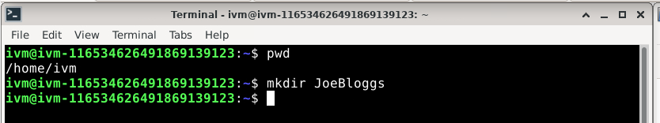

Creates a new (empty) directory on /home/ivm:

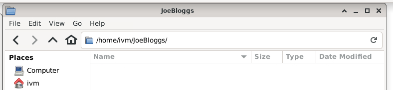

The equivalent directory on red is not empty (it contains several files and sub and sub-sub directories):

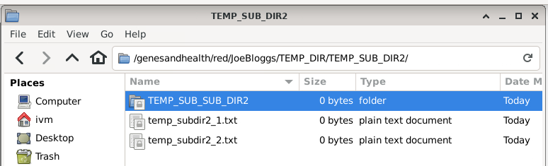

Now mount red’s JoeBloggs locally:

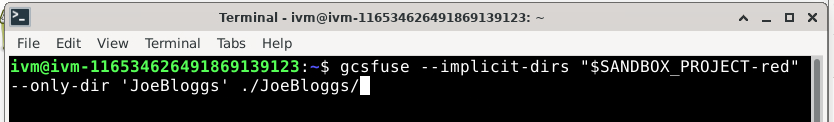

Which tells us:

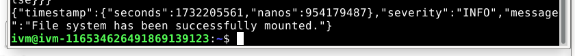

Now look at /home/ivm/JoeBloggs:

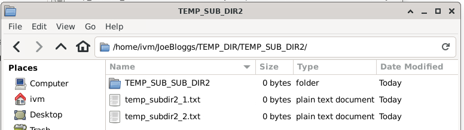

All the files, directories, sub and sub-sub directories from red’s JoeBloggs are mirrored.

But `/home/ivm/JoeBloggs/` “behaves” like any linux directory:


You can add files in any of these various directories:

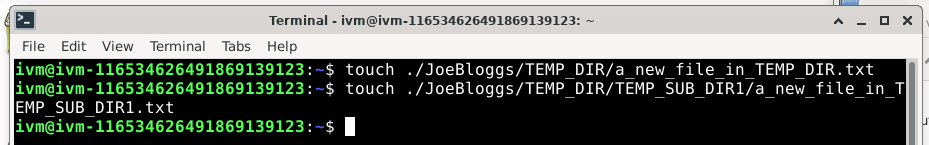

And they appear on the locally mounted JoeBloggs:

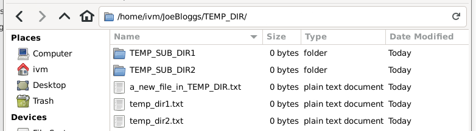

And…

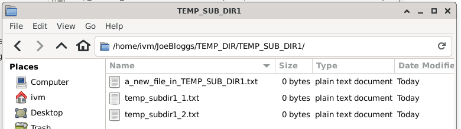

**But they also appear in the red GCS bucket!**

Note: You may have to click the 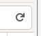 refresh circular arrow in the top right corner to see the changes.

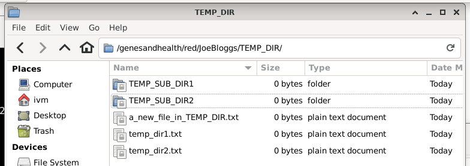
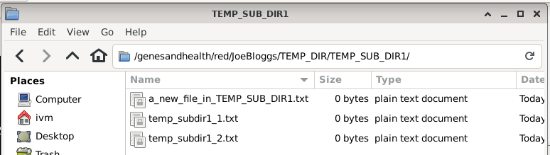

If you delete a file in the GCS red bucket:

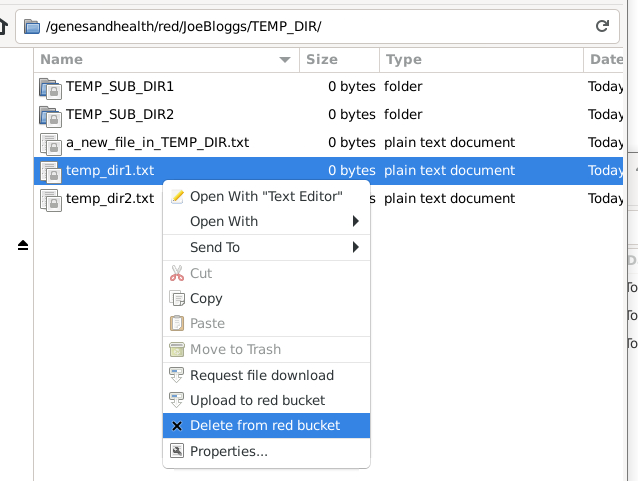

**The file will also be deleted from the locally mounted mirror:**

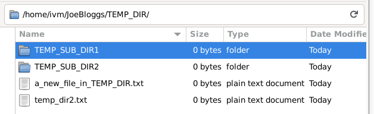

Likewise, if you delete a file in the locally mounted mirror:

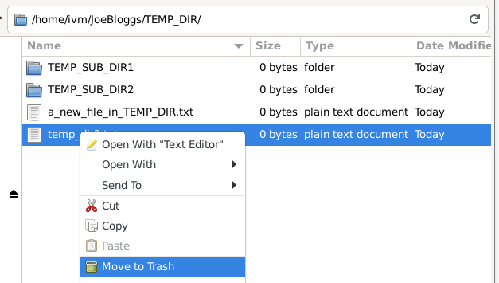

The file will also be deleted from the red GCS bucket:

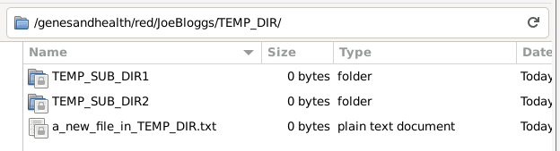